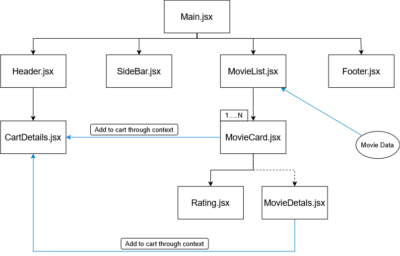

[Live URL](#-live-url) | [Component Tree](#-component-tree) | [Built With](#️-built-with) | [Features](#-features) | [Things I Got to Learn](#-things-i-got-to-learn-from-this-project) | [Getting Started](#️-getting-started)

# Movie Shop

A simple Movie buying site desing with cool interactions and features.

## 🚀 Live URL

[]()

---

## 🧩 Component Tree



---

## 🛠️ Built With

- React (Functional Components + Hooks)
- JavaScript (ES6+)
- Tailwind CSS
- Vite

---

## ✨ Features

- Fully responsive layout
- Light and Dark mode toggle
- Dynamic cart
- Updating cart item live
- Minimal and friendly UI

---

## 📚 Things I got to learn from this project

- State management efficiently
- Lifting state up for shared logic
- Immutability principles in React
- Component-based architecture
- Efficiently props passing
- Event Handling for every possilble user interaction.
- Overriding existed state without breaking the Immutability
- Toggling dark mode feature implementation
- React Context API to avoid props drilling.
- Prevent Event Propagations
- Using JSON data to display UI
- Building custom utility functions

---

## ⚙️ Getting started

```bash
-> git clone https://github.com/Ashik-2000/MovieShop_using_react.git
-> cd MovieShop_using_react
-> npm install
-> npm install tailwindcss @tailwindcss/vite
-> npm install react icons
-> npm run dev
```

✅
